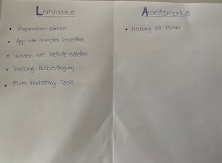

+++
title = "Brainstorming Projekt"
date = "2020-08-12"
draft = false
pinned = false
image = ""
+++

# Brainstorming Projekt

Erster Tag, die ersten Paar Lektionen hatten wir die Zeit uns zu überlegen, in welcher Richtung unser Projekt gehen soll. Wir bekamen gut anderthalb Stunden Zeit, um uns damit auseinanderzusetzen. Dabei mussten wir Stichworte zu Lern- und Arbeitsmodus aufschreiben. Meine Kollegin und ich setzten uns draussen im Freien und recherchierten. Danach tauschten wir uns über unsere Ideen aus und kamen auf die Idee eine App zu entwickeln. Eine Idee worum es in dieser App sich handeln soll war, eine App, die mögliche Gefahren mitteilt. Zum Beispiel wenn man über eine gewisse Zeit verfolgt wird oder sich in der Nähe befindet, während man unterwegs ist. Man sollte durch die App auch auf Notruf oder sonstige Notfallnummer, die man vorher einspeichern kann, schnell wählen können. (Per Knopfdruck)