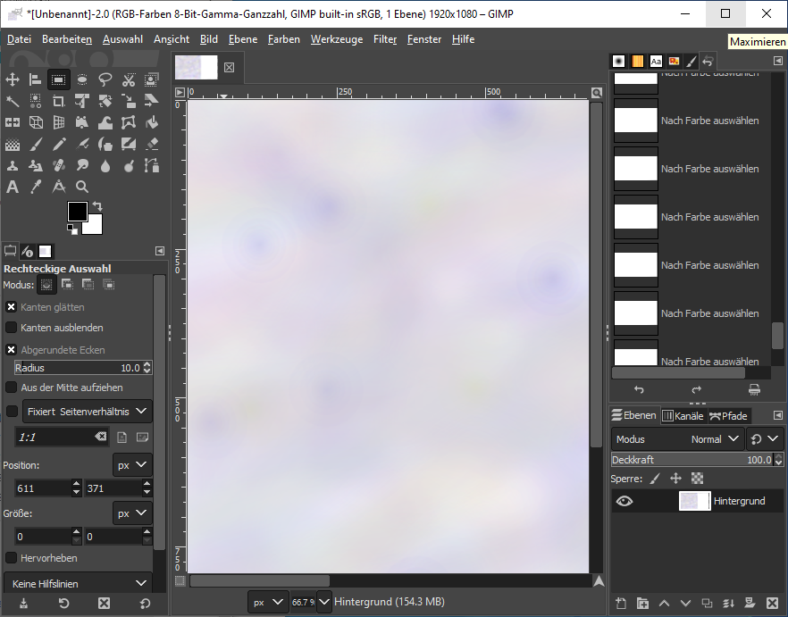

+++
title = "Photoshop Gimp "
date = "2020-12-09"
draft = false
pinned = false
image = "gimp-new.png"
description = ""
+++
Trying out something new!

Heute habe ich nicht besonders an unserem Projekt weitergearbeitet, weil meine Projektpartnerin nicht da war. Dafür habe ich mich mit dem Photoshop Programm Gimp auseinander gesetzt. Ich konnte viele Tools mithilfe eines Tutorials ausprobieren und verschiedenes entdecken. Das Video zeigt Schritt für Schritt was sich wo befindet und wie man was benutzt. Da das Programm eher komplexer aufgebaut ist, finde ich hat das Video besonders geholfen, das zu finden was ich wollte. Ich habe einige Entwürfe gemacht und eines davon ist unten zu sehen.

