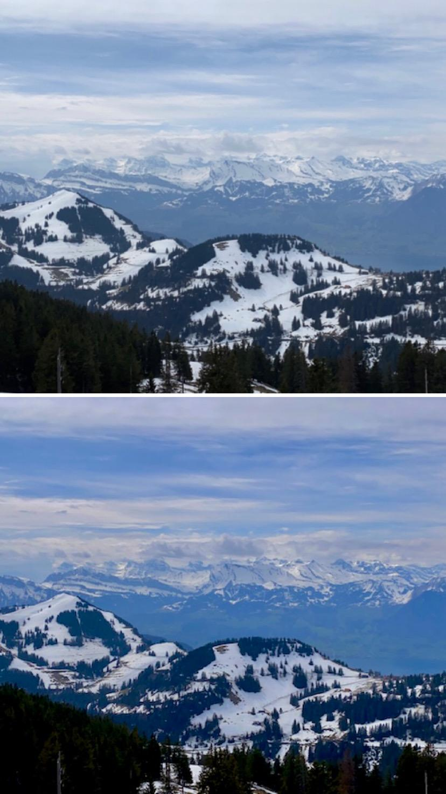
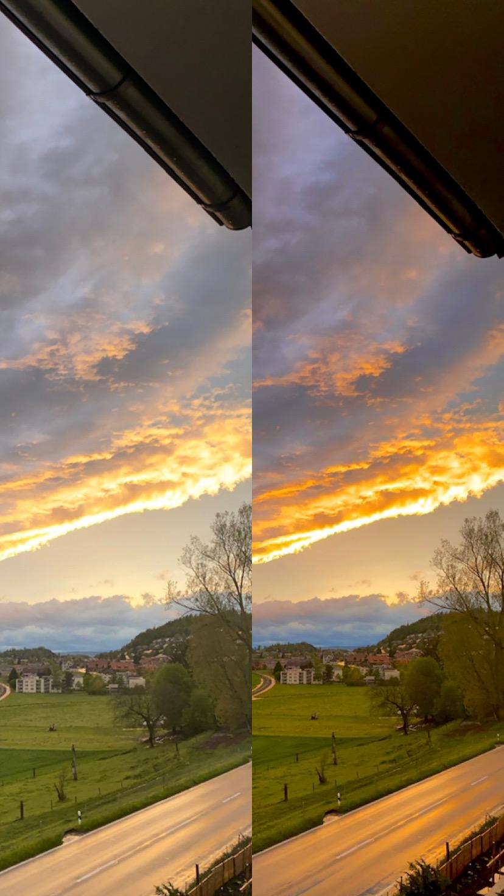
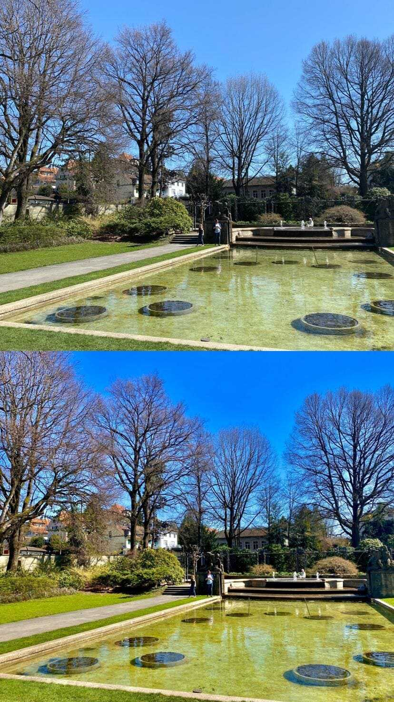

+++
title = "Projekt Fotografie"
date = "2021-05-19"
draft = false
pinned = false
image = "photo-2021-05-19-16-15-03-min-2_optimized.jpg"
+++
Heute haben wir einige Bilder geschossen, aber vor allem unsere gemachten Bilder bearbeitet. Das Bearbeiten hat mehr Zeit gekostet als ich dachte. Dennoch sind wir sehr zufrieden mit unseren Bilder. Wir haben insgesamt 4 Bilder ausgewählt für den Blogeintrag. Unten sieht man zu jedem der vier Bilder jeweils Vor- und nach der Bearbeitung. Da die Dateien etwas zu gross waren, mussten wir die Bilder davor komprimieren. 

