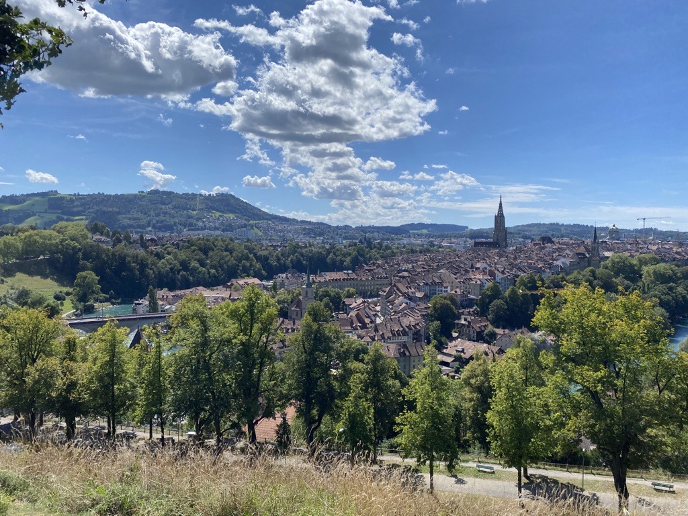

+++
title = "Projektideensammlung"
date = "2020-08-26"
draft = false
pinned = false
+++
**Beginn der kleinen Reise**

Zwei Stunden Zeit und eine Menge voller Ideen. Wir liessen unseren Gedanken freien Lauf und schrieben mögliche Probleme aber auch Ideen auf. Die kleine Reise begann im Rosengarten. Da überlegten wir was hilfreich wäre oder was fehlt. Rasch kam die Idee einen Künstler oder Fotograph zu arrangieren, der vielleicht alle Samstage für die Touristen ein Portrait zeichnen oder Bild schiessen würde. Als wir einige Minuten die Aussicht geniessten, stellten wir uns vor wie es wäre, wenn eine kleine Gondelbahn von Rosengarten bis zu Gurten mit einem Zwischenstopp fahren würde. Man könnte von oben die Altstadt sehen, hat eine direkte Verbindung zur Gurtenbahn und somit eine neue "Sehenswürdigkeit", was mir in Bern etwas fehlt. 

Auf dem Weg hinab, sahen wir den Bärenpark, was ein sehr bekannter Touristenplatz ist. Wir stellten uns zuerst vor Depotbecher für Touristen wie sonstige Besucher der Altstadt zu Verfügung zu stellen, mit kleinen Wasserstationen. Man müsste nur für den Becher zahlen, kann aber beliebig Wasser auffüllen. Möglicherweise könnte man einen Teil des Gewinns an Länder, die Hilfe brauchen spenden. Damit kann einerseits jeder Durst gelöscht werden und andererseits einer Organisation weiterhelfen.